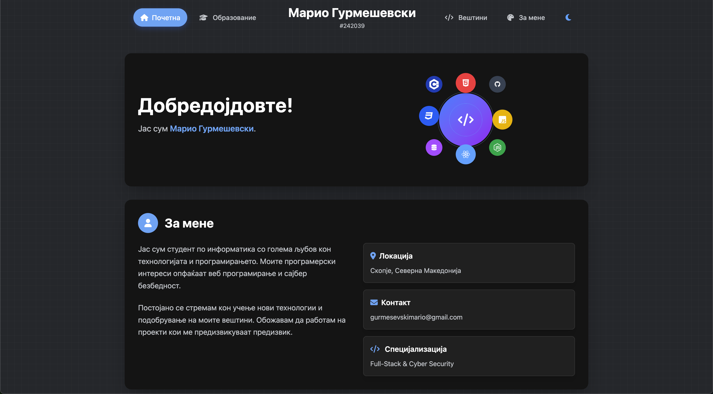

# portfolio-basic

**portfolio-basic** is a personal website for Mario Gurmeshevski, designed as a modern, responsive, and easy-to-use portfolio. The project is built with HTML, CSS (Tailwind CSS), and JavaScript, and is fully static with no backend.

## Features

- 🌙 **Dark/Light mode** – Theme toggle with preference.
- 🧩 **Modular structure** – Header and footer are dynamically loaded for easier maintenance.
- 🛠️ **Tech stack** – HTML5, CSS3, Tailwind CSS, JavaScript.
- 📚 **Easy customization** – Every section can be edited as needed.

## Getting Started Locally

1. Clone the repository:
   ```sh
   git clone https://github.com/mario-gurmeshevski/portfolio-basic.git
   ```
2. Navigate to the project directory:
   ```sh
   cd portfolio-basic
   ```
3. Open `index.html` in your preferred web browser to view the website.

## Deployment

For deployment, you can use any static site hosting service, like GitHub Pages, Netlify, or Vercel. Just push your code to a GitHub repository and connect it to your preferred hosting service for automatic deployment.

## Links

- [Live Demo](https://mario-gurmeshevski.github.io/portfolio-basic/)
- [Github Repository](https://github.com/mario-gurmeshevski/portfolio-basic)

## Preview



## License

MIT License © 2025 Mario Gurmeshevski
